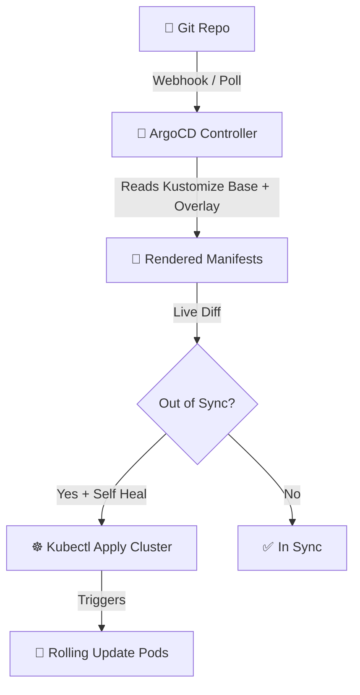

# 🚀 ArgoCD GitOps App Studio
> **Orchestrate automated continuous GitOps synchronizations. Generate declarative Application manifests, secure projects wrappers, and CLI setups.**

[](https://pradeeptalari14.github.io/portfolio/tools/argocd/)
[]()

---

## 🎛️ Studio Options — What the UI Generates

The studio has multiple configurable options. Each combination produces different output files.
This repository contains **one working example per option variant** so you can learn by diffing.

### Output Tabs (files the studio generates)
| Tab | Description |
|-----|-------------|
| `application.yaml` | Generated in studio Output tab |
| `kustomization.yaml` | Generated in studio Output tab |
| `overlays/production/kustomization.yaml` | Generated in studio Output tab |
| `overlays/production/deployment-patches.yaml` | Generated in studio Output tab |
| `bootstrap.sh` | Generated in studio Output tab |
| `Flow Diagram` | Generated in studio Output tab |

### Configurable Options
| Option | Available Values |
|--------|-----------------|
| **Sync Policy** | `Automated` / `Manual` |
| **Self Healing** | `enabled` / `disabled` |
| **Prune Resources** | `enabled` / `disabled` |

---

## 🏗️ Architecture Flow Diagram




---

## 📁 Repository Structure

```
tp-argocd/
├── README.md          ← This file — complete learning guide
├── argocd/application.yaml
├── argocd/kustomization.yaml
├── argocd/overlays/production/kustomization.yaml
├── argocd/overlays/production/deployment-patches.yaml
├── scripts/bootstrap.sh
├── scripts/           ← Deployment + validation helpers
└── docs/USAGE.md      ← Extended usage guide
```

---

## ⚡ Quick Start

### Step 1 — Generate files from the Studio
1. Open **[ArgoCD GitOps App Studio Studio](https://pradeeptalari14.github.io/portfolio/tools/argocd/)**
2. Select your option values in the UI
3. Watch the output update live in the editor
4. Click **Download** or **Copy** for each tab

### Step 2 — Use the example files in this repo
```bash
git clone https://github.com/Pradeeptalari14/tp-argocd.git
cd tp-argocd
# Browse examples/ to find the variant matching your needs
# Copy the relevant files into your project
```

---

## 🔄 Complete Start-to-End Workflow


---

## 📖 How Each Option Changes the Output

### Sync Policy
- **`Automated`** — see `examples/` folder for generated output
- **`Manual`** — see `examples/` folder for generated output

### Self Healing
- **`enabled`** — see `examples/` folder for generated output
- **`disabled`** — see `examples/` folder for generated output

### Prune Resources
- **`enabled`** — see `examples/` folder for generated output
- **`disabled`** — see `examples/` folder for generated output

---

## 💡 SRE Compliance & Best Practices

| SRE Compliance Pillar | ❌ Anti-Pattern | ✅ Production Best Practice |
|---|---|---|
| **State Syncing** | Manually running manual kubectl tweaks on live clusters | Treat Git repository as the single source of truth; enforce Auto-Sync |
| **Value Pinning** | Using generic mutable image tags | Track immutable image digests in Helm values files for predictable rollouts |
| **Self-Healing** | Ignoring manual configuration drift | Enable ArgoCD Self-Healing to automatically revert manual cluster edits |

## 🔐 Security Standards

- ❌ Never commit credentials, API keys, or database passwords directly to Git repositories.
- ✅ Reference dynamic parameters using cloud Secret Managers (Vault, AWS SSM Parameter Store, Key Vault).
- ✅ Enforce branch protection rules: require peer pull request reviews and green status checks.

---

## 📖 Resources

| Resource | Link |
|----------|------|
| Interactive Studio | [Open →](https://pradeeptalari14.github.io/portfolio/tools/argocd/) |
| All 91 Studios | [Dashboard →](https://pradeeptalari14.github.io/portfolio/tools/) |
| SRE Provisioning Guide | [Handbook →](https://github.com/Pradeeptalari14/portfolio/blob/main/GITHUB_PROVISIONING_GUIDE.md) |

---
*Generated by [ArgoCD GitOps App Studio Studio](https://pradeeptalari14.github.io/portfolio/tools/argocd/) — [Talari Pradeep Portfolio](https://pradeeptalari14.github.io/portfolio)*